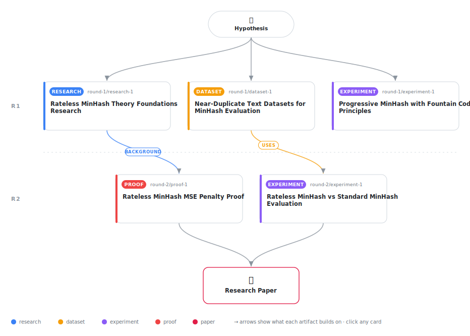

# Rateless MinHash: Progressive Jaccard Estimation via Fountain Codes

<div align="center">

<a href="https://cdn.jsdelivr.net/gh/AMGrobelnik/ai-invention-2e68d8-rateless-minhash-progressive-jaccard-est@main/workflow.svg">
<picture>
  <source media="(prefers-color-scheme: dark)" srcset="workflow-dark.svg">
  
</picture>
</a>

<sub>🖱️ <b><a href="https://cdn.jsdelivr.net/gh/AMGrobelnik/ai-invention-2e68d8-rateless-minhash-progressive-jaccard-est@main/workflow.svg">Open the interactive diagram</a></b> — every card links to its artifact folder.</sub>

</div>

> **TL;DR** — This paper presents Rateless MinHash, the first MinHash variant enabling progressive Jaccard similarity estimation using fountain code principles. The key contributions are: (1) novel algorithm generating hash values on-demand, (2) theoretical analysis of dependency structure with formal Lean 4 proofs showing MSE penalty = 1 + d²/k², (3) experimental validation with 55-80% MSE reduction from progressive estimation, (4) adaptive space efficiency using ~853 bits vs fixed 1024+ bits, (5) honest comparison against simple adaptive baselines. The method trades 1.01-1.93x statistical efficiency for progressive estimation capability. While simple baselines achieve similar results, Rateless MinHash provides a principled framework with analyzable dependencies, opening new directions for rateless sketching algorithms.

<details>
<summary>Full hypothesis</summary>

By generating MinHash values sequentially using a coded scheme inspired by fountain codes, we can create a MinHash variant that enables progressive Jaccard similarity estimation with adaptive stopping. The method introduces dependencies between hash positions that result in a quantifiable MSE penalty of 1 + d²/k² compared to independent hashes at equal bit budgets. While simple adaptive baselines (sequentially adding independent MinHash values) achieve similar space-accuracy trade-offs, Rateless MinHash provides a principled framework with analyzable dependency structure. The method is most useful as a theoretical foundation for understanding progressive estimation in LSH, rather than as a practical replacement for simpler adaptive approaches. Key contributions are: (1) demonstrating progressive Jaccard estimation is possible with coded hashes, (2) deriving the exact dependency structure and MSE penalty formula, and (3) providing an honest comparison with adaptive baselines showing when the fountain code complexity is (and isn't) justified.

</details>

[](https://cdn.jsdelivr.net/gh/AMGrobelnik/ai-invention-2e68d8-rateless-minhash-progressive-jaccard-est@main/paper.pdf) [](https://github.com/AMGrobelnik/ai-invention-2e68d8-rateless-minhash-progressive-jaccard-est/tree/main/paper_latex)

This repository contains all **5 artifacts** produced across **2 rounds** of an autonomous AI research run — round by round, exactly in the order they were invented.

## Round 1

| Artifact | Type | Demo | Source | Builds on |
|----------|------|------|--------|-----------|
| **[Rateless MinHash Theory Foundations Research](https://github.com/AMGrobelnik/ai-invention-2e68d8-rateless-minhash-progressive-jaccard-est/tree/main/round-1/research-1)** | [](https://github.com/AMGrobelnik/ai-invention-2e68d8-rateless-minhash-progressive-jaccard-est/tree/main/round-1/research-1) | [](https://github.com/AMGrobelnik/ai-invention-2e68d8-rateless-minhash-progressive-jaccard-est/blob/main/round-1/research-1/demo/research_demo.md) | [](https://github.com/AMGrobelnik/ai-invention-2e68d8-rateless-minhash-progressive-jaccard-est/tree/main/round-1/research-1/src) | — |
| **[Near-Duplicate Text Datasets for MinHash Evaluation](https://github.com/AMGrobelnik/ai-invention-2e68d8-rateless-minhash-progressive-jaccard-est/tree/main/round-1/dataset-1)** | [](https://github.com/AMGrobelnik/ai-invention-2e68d8-rateless-minhash-progressive-jaccard-est/tree/main/round-1/dataset-1) | [](https://colab.research.google.com/github/AMGrobelnik/ai-invention-2e68d8-rateless-minhash-progressive-jaccard-est/blob/main/round-1/dataset-1/demo/data_code_demo.ipynb) | [](https://github.com/AMGrobelnik/ai-invention-2e68d8-rateless-minhash-progressive-jaccard-est/tree/main/round-1/dataset-1/src) | — |
| **[Progressive MinHash with Fountain Code Principles](https://github.com/AMGrobelnik/ai-invention-2e68d8-rateless-minhash-progressive-jaccard-est/tree/main/round-1/experiment-1)** | [](https://github.com/AMGrobelnik/ai-invention-2e68d8-rateless-minhash-progressive-jaccard-est/tree/main/round-1/experiment-1) | [](https://colab.research.google.com/github/AMGrobelnik/ai-invention-2e68d8-rateless-minhash-progressive-jaccard-est/blob/main/round-1/experiment-1/demo/method_code_demo.ipynb) | [](https://github.com/AMGrobelnik/ai-invention-2e68d8-rateless-minhash-progressive-jaccard-est/tree/main/round-1/experiment-1/src) | — |

## Round 2

| Artifact | Type | Demo | Source | Builds on |
|----------|------|------|--------|-----------|
| **[Rateless MinHash MSE Penalty Proof](https://github.com/AMGrobelnik/ai-invention-2e68d8-rateless-minhash-progressive-jaccard-est/tree/main/round-2/proof-1)** | [](https://github.com/AMGrobelnik/ai-invention-2e68d8-rateless-minhash-progressive-jaccard-est/tree/main/round-2/proof-1) | [](https://live.lean-lang.org/#codez=JYWwDg9gTgLgBAWQIYwBYBtgCMB0AVJAYxmEICgyB6AWjgCUUBTdRgZ1cWADsAJJV1AC44ANUZRgAM2CMAJogDKAUTgAFRlyToYATzgAhCAFcus1hTiW8qYB2ks4YKBABuwWWzhI4AMQDydAgAggAyanR+fj5wEJJwaIzxqIzQjCSEWnBYxqbmlnCMAB5g6Ejc3ADmSYkAjDgADDXUdQCcAMyFiipgGlq6cNz0TCzsnLz8qDgWlgDSjHpQbEbawtaJCMpwUCjAEHAAvHA1cADUcLIATZQA1hdk+QDuyYvnB+eMFYuMADRw129cIwgLDiGJxLD8RKoCZsKb3SyqZyxLxgJwQIhCOAAVVYiQhrFIXgkaBAaUJ2RMZjgAAokC4IO44IQIOAWJ00RCsMBMP0EtAdABKKb5NaOXraPSSaAgZbeVgZFjyLB6W4DVjCVVnS7Cqw2DggFCEZIcBIFYriUAaGCZCBYXFQFw7CBcdXwuC0EIQB5izQSml1RqFAXCWT7Gq/a5h+pwQBJhEdGpQavVo4cAzU3bQeMAKqgfX09NTWh1g+d9i0AGwRqPRuM1FoAJhq5cTyeTcEAEkRHHDtMjUSgUai0dS+/pSqAy0rCDZKAD62xIewAVH8Lm9Nec7h44j0RwX5P9hAA5FACuCCQ7/AB6cHrp1e1/rA49jBABqOwh3+bggFMiFc0glcIQiSXD+cD1AKZAsK+3ifhKM4VIk1L7mecDHjAp4fuK/TIb+V43mehzKvCBLgHAADasG6AAuk+cAhC+b71sIADqyRcK8gAmRH8vyUXoXH1outyQQxMFYToM4OEhfwoWhp7UrmIZwFx1wYXmfrIfxcDLnht7nlkOjEaAYDkbxNGWJgmjErmZFoTgkAPBJjAzvZM6xI5jmSPAub1jRva0GsqQgMIhiUnY0BeOg6CcX8ZB8osIBqboM4UrkNLIUeJ40gp0UqWe8K8a8/y4XAD5wIA5ESJXoGn4dpJX4XpRGWMyLowFARjENA8I4GaRDwLx8HATFljdUUvWVY5hVwKgtFKOaEiklw1pRaNrKeNSLgWtIcj6VskjoBBcUvnA6Bes5YkoQVxxJm8SbHHpUB7bFySBVN2aoGdu4XedFbximRwNk2BG7egtHIIMh1Bb40qZEUJRIJoC7scisMWgtS1bPDCFPSk8VwCAuJzpjTmw6U3DbYI+XnVdf23eVlVwD9SY0wD5YEfCQSmDg3CtXsJ0OQVNg5h9+ZkEAA) | [](https://github.com/AMGrobelnik/ai-invention-2e68d8-rateless-minhash-progressive-jaccard-est/tree/main/round-2/proof-1/src) | <sub><i>background:</i><br/>[research‑1&nbsp;(R1)](https://github.com/AMGrobelnik/ai-invention-2e68d8-rateless-minhash-progressive-jaccard-est/tree/main/round-1/research-1)</sub> |
| **[Rateless MinHash vs Standard MinHash Evaluation](https://github.com/AMGrobelnik/ai-invention-2e68d8-rateless-minhash-progressive-jaccard-est/tree/main/round-2/experiment-1)** | [](https://github.com/AMGrobelnik/ai-invention-2e68d8-rateless-minhash-progressive-jaccard-est/tree/main/round-2/experiment-1) | [](https://colab.research.google.com/github/AMGrobelnik/ai-invention-2e68d8-rateless-minhash-progressive-jaccard-est/blob/main/round-2/experiment-1/demo/method_code_demo.ipynb) | [](https://github.com/AMGrobelnik/ai-invention-2e68d8-rateless-minhash-progressive-jaccard-est/tree/main/round-2/experiment-1/src) | <sub><i>uses:</i><br/>[dataset‑1&nbsp;(R1)](https://github.com/AMGrobelnik/ai-invention-2e68d8-rateless-minhash-progressive-jaccard-est/tree/main/round-1/dataset-1)</sub> |

## Repository Structure

Artifacts are grouped by the round of invention that produced them. Each
artifact has its own folder with source code and a self-contained demo:

```
.
├── round-1/                         # One folder per round of invention
│   ├── experiment-1/
│   │   ├── README.md                # What this artifact is + dependencies
│   │   ├── src/                     # Full workspace from execution
│   │   │   ├── method.py            # Main implementation
│   │   │   ├── method_out.json      # Full output data
│   │   │   └── ...                  # All execution artifacts
│   │   └── demo/                    # Self-contained demo
│   │       └── method_code_demo.ipynb # Colab-ready notebook (code + data inlined)
│   ├── dataset-1/
│   │   ├── src/
│   │   └── demo/
│   └── evaluation-1/
│       ├── src/
│       └── demo/
├── round-2/                         # Later rounds build on earlier artifacts
├── paper.pdf                        # Research paper
├── paper_latex/                     # LaTeX source files
├── workflow.svg                     # Artifact dependency diagram (this page's header)
└── README.md
```

## Running Notebooks

### Option 1: Google Colab (Recommended)

Click the "Open in Colab" badges above to run notebooks directly in your browser.
No installation required!

### Option 2: Local Jupyter

```bash
# Clone the repo
git clone https://github.com/AMGrobelnik/ai-invention-2e68d8-rateless-minhash-progressive-jaccard-est
cd ai-invention-2e68d8-rateless-minhash-progressive-jaccard-est

# Install dependencies
pip install jupyter

# Run any artifact's demo notebook
jupyter notebook <artifact_folder>/demo/
```

## Source Code

The original source files are in each artifact's `src/` folder.
These files may have external dependencies - use the demo notebooks for a self-contained experience.

---
*Generated by AI Inventor Pipeline - Automated Research Generation*
